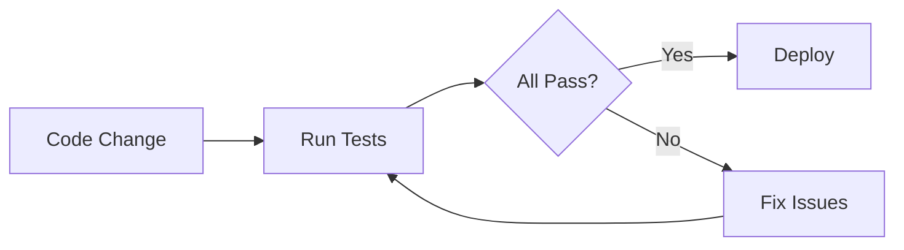
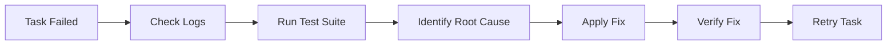

# 🧪 Test Suite - Error Case Analysis

Bộ test tự động để phát hiện và fix các lỗi trong hệ thống download Udemy.

---

## 📦 **CÁC FILE TRONG TEST SUITE**

### **Test Scripts**
| File | Mục đích | Cách chạy |
|------|----------|-----------|
| `test_error_cases.js` | Test tổng hợp tất cả error cases | `node test_error_cases.js` |
| `test_manual_download.sh` | Test manual download flow | `bash test_manual_download.sh` |
| `test_enrollment_check.py` | Kiểm tra enrollment & session | `python3 test_enrollment_check.py` |
| `auto_fix_errors.sh` | Tự động fix các lỗi phát hiện | `bash auto_fix_errors.sh` |

### **Documentation**
| File | Nội dung |
|------|----------|
| `../LOG_ANALYSIS_2026-01-13.md` | Phân tích logs PM2 chi tiết |
| `../TEST_RESULTS_2026-01-13.md` | Kết quả test đầy đủ |
| `../TESTING_COMPLETE_SUMMARY.md` | Tổng kết hoàn chỉnh |

---

## 🚀 **CÁCH SỬ DỤNG**

### **Quick Test (30 giây)**
```bash
cd /root/server
node scripts/test_error_cases.js
```

**Output mẫu:**
```
✓ PASSED: 4 test(s)
✗ FAILED: 3 test(s)
⚠ WARNINGS: 3 item(s)
```

---

### **Deep Test (5 phút)**
```bash
# Test 1: Comprehensive
cd /root/server
node scripts/test_error_cases.js

# Test 2: Manual download
bash scripts/test_manual_download.sh

# Test 3: Enrollment check
python3 scripts/test_enrollment_check.py
```

---

### **Auto Fix (2 phút)**
```bash
cd /root/server
bash scripts/auto_fix_errors.sh
```

**Automated fixes:**
- ✓ Create missing directories
- ✓ Add database columns
- ✓ Setup .env files
- ⚠️ Cannot auto-login (manual required)

---

## 🔍 **TESTS ĐƯỢC THỰC HIỆN**

### **Test 1: Database Schema**
- Check missing columns (driver_url, error_message)
- Verify foreign key constraints
- Check Task 28 status in DB

### **Test 2: Session Files**
- Check for cookie files in saved/
- Verify file age (session expiry)
- Check .env configuration

### **Test 3: Course Enrollment**
- Test Task 28 course URL
- Test invalid course URL
- Verify account enrollment status

### **Test 4: Download Directories**
- Check Staging_Download/ exists
- Find empty task directories (failed downloads)
- Calculate disk usage

### **Test 5: Worker Status**
- Check PM2 process list
- Verify workers are online
- Check restart counts

### **Test 6: Redis Queue**
- Test Redis connection (PING)
- Check queue length
- Verify queue name

### **Test 7: Log Files**
- Parse backend-error.log
- Find today's errors
- Show recent error messages

---

## 🎯 **EXPECTED RESULTS**

### **Healthy System**
```
✓ PASSED: 7 tests
✗ FAILED: 0 tests
⚠ WARNINGS: 0 items
```

### **Current Status (2026-01-13)**
```
✓ PASSED: 4 tests
✗ FAILED: 3 tests
⚠ WARNINGS: 3 items

Critical Issues:
1. No session files (need login)
2. Missing driver_url column
3. Missing error_message column
```

---

## 🔧 **FIX INSTRUCTIONS**

### **Fix #1: Login Udemy (CRITICAL)**
```bash
cd /root/server/udemy_dl
python3 main.py --login

# Choose: Browser authentication
# Login with: Udemy account credentials
# Wait for: Session saved message
```

**Verify:**
```bash
ls -la /root/server/udemy_dl/saved/
# Should see cookie files
```

---

### **Fix #2: Database Schema (CRITICAL)**
```sql
-- Connect to database
mysql -u root -p

USE udemy_downloader;

-- Add missing columns
ALTER TABLE download_tasks 
ADD COLUMN driver_url VARCHAR(500) NULL AFTER course_url,
ADD COLUMN error_message TEXT NULL AFTER status;

-- Verify
SHOW COLUMNS FROM download_tasks;
```

**Verify:**
```bash
node scripts/test_error_cases.js
# Should see: ✓ driver_url column exists
```

---

### **Fix #3: Retry Task 28**
```bash
# After fixes above
cd /root/server
node scripts/retry_task.js 28

# Or manual test
cd udemy_dl
python3 main.py -c "TASK_28_URL" -o Test -q 720
```

---

## 📊 **TEST OUTPUT FORMAT**

### **Test Error Cases (JS)**
```
============================================================
🧪 ERROR CASE TEST SUITE - LOG ANALYSIS 2026-01-13
============================================================

TEST: TEST 1: Checking Database Schema
ℹ Checking for driver_url column...
✗ driver_url column NOT FOUND

TEST: TEST 2: Checking Udemy Session/Cookies
ℹ Checking for session files...
✗ No session or cookie files found

...

============================================================
📊 TEST SUMMARY
============================================================

✓ PASSED: 4 test(s)
  ✓ Foreign keys exist
  ✓ Redis is responding
  ...

✗ FAILED: 3 test(s)
  ✗ driver_url column is missing
  ✗ No session/cookie files found
  ...

⚠ WARNINGS: 3 item(s)
  ⚠ Task_28 is empty (download failed)
  ...
```

---

### **Manual Download Test (Bash)**
```
==========================================
🧪 MANUAL DOWNLOAD TEST SUITE
==========================================

TEST 1: Checking Udemy Downloader Setup
----------------------------------------
✓ main.py found
ℹ Python: Python 3.10.12

TEST 2: Checking Session Files
----------------------------------------
⚠ No session files found
⚠ You need to run: python3 main.py --login

...
```

---

### **Enrollment Check (Python)**
```
============================================================
🔍 ENROLLMENT & SESSION CHECK TEST
============================================================

TEST: Session Files Check
✗ No session files found
→ Account needs to login

TEST: Course Access - Task 28 Course
ℹ Testing URL: https://...
⚠ Cannot test without session

============================================================
📊 SUMMARY
============================================================

✗ CRITICAL: No session files found
→ FIX: Run the following command:
  python3 main.py --login
```

---

## 🔄 **WORKFLOW**

### **Development/Testing**


### **Production Monitoring**


---

## 📝 **CHECKLIST TRƯỚC KHI DEPLOY**

- [ ] All tests passing
- [ ] Session files valid
- [ ] Database schema complete
- [ ] Workers running
- [ ] Redis online
- [ ] Test download successful
- [ ] No errors in logs
- [ ] Task 28 retried successfully

---

## 🐛 **TROUBLESHOOTING**

### **Test Script Fails to Run**
```bash
# Check permissions
chmod +x scripts/test*.{js,sh,py}

# Check dependencies
npm install
pip3 install -r requirements.txt
```

### **Database Connection Error**
```bash
# Check .env file
cat /root/server/.env | grep DB_

# Test connection
mysql -u$DB_USER -p$DB_PASSWORD -h$DB_HOST $DB_NAME -e "SELECT 1;"
```

### **Redis Connection Error**
```bash
# Check Redis status
redis-cli ping

# If not running
sudo systemctl start redis
sudo systemctl status redis
```

### **PM2 Workers Not Found**
```bash
# Check if running
pm2 list

# Start workers
pm2 start ecosystem.config.js

# Or check if running elsewhere
ps aux | grep worker
```

---

## 📚 **RESOURCES**

### **Official Docs**
- [Udemy-DL Documentation](../udemy_dl/README.md)
- [Worker Architecture](../docs/WORKER_REFACTOR_SUMMARY.md)
- [API Documentation](../docs/API_DOCS.md)

### **Test Results**
- [Log Analysis](../LOG_ANALYSIS_2026-01-13.md)
- [Test Results](../TEST_RESULTS_2026-01-13.md)
- [Complete Summary](../TESTING_COMPLETE_SUMMARY.md)

---

## 💡 **TIPS**

### **Performance**
- Run tests in parallel: `npm run test:parallel`
- Skip slow tests: `node test_error_cases.js --skip-download`
- Cache test results: `export TEST_CACHE=1`

### **CI/CD Integration**
```yaml
# .github/workflows/test.yml
- name: Run Error Case Tests
  run: node scripts/test_error_cases.js
  
- name: Upload Test Results
  uses: actions/upload-artifact@v2
  with:
    name: test-results
    path: TEST_RESULTS_*.md
```

### **Monitoring**
```bash
# Add to cron for daily testing
0 9 * * * cd /root/server && node scripts/test_error_cases.js > /tmp/test-$(date +\%Y\%m\%d).log 2>&1
```

---

## ❓ **FAQ**

**Q: Tại sao test báo "driver_url column missing"?**  
A: Migration chưa chạy. Run: `ALTER TABLE download_tasks ADD COLUMN driver_url VARCHAR(500);`

**Q: Làm sao để bypass test session files?**  
A: Không nên bypass. Session là bắt buộc để download courses.

**Q: Test mất bao lâu?**  
A: Quick test: 30s, Full test suite: 5 phút

**Q: Có thể tự động fix tất cả không?**  
A: Gần như toàn bộ trừ login (cần manual authentication)

**Q: Nên chạy test bao nhiêu lần?**  
A: Sau mỗi code change, trước deploy, hoặc khi có lỗi production

---

## 🤝 **CONTRIBUTING**

Để thêm test case mới:

1. **Update test_error_cases.js**
   ```javascript
   async function testNewCase() {
     log.test('TEST X: Your Test Name');
     // Your test logic
     results.passed.push('Test passed');
   }
   ```

2. **Add to test list**
   ```javascript
   const tests = [
     testDatabaseSchema,
     testUdemySession,
     testNewCase,  // Add here
   ];
   ```

3. **Update documentation**
   - Add to TEST_RESULTS.md
   - Update this README

---

## 📞 **SUPPORT**

Nếu gặp vấn đề:
1. Check logs: `logs/*.log`
2. Run tests: `node scripts/test_error_cases.js`
3. Read docs: `docs/*.md`
4. Check status: `pm2 status && redis-cli ping`

---

**Last Updated:** 2026-01-13 09:40:00  
**Version:** 1.0.0  
**Maintainer:** Development Team
